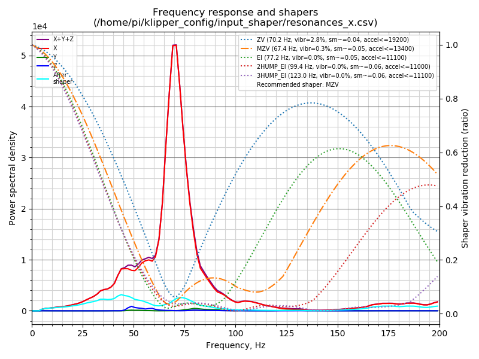
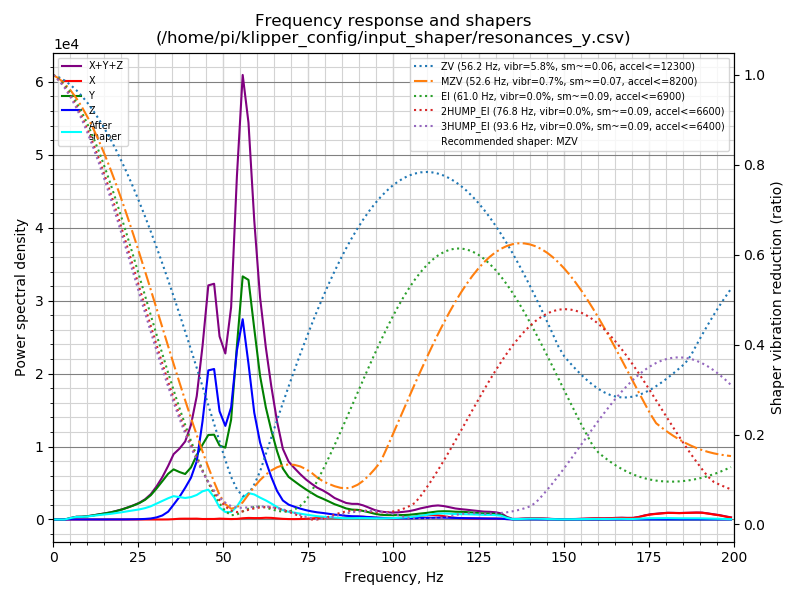

# Voron 2.4 (300mm³)

- [Voron 2.4 (300mm³)](#voron-24-300mm)
- [Input Shaper](#input-shaper)
- [Update Klipper](#update-klipper)
  - [RPi](#rpi)
  - [Spider](#spider)

<br/><br/>

# Input Shaper




<br/><br/>

# Update Klipper

## RPi

```bash
$ make menuconfig
```

```
[*] Enable extra low-level configuration options
    Micro-controller Architecture (Linux process)  --->
()  GPIO pins to set at micro-controller startup
```

```bash
$ make clean && make
$ sudo service klipper stop
$ make flash
$ sudo service klipper start
```

## Spider
```bash
$ make menuconfig
```

```
[*] Enable extra low-level configuration options
    Micro-controller Architecture (STMicroelectronics STM32)  --->
    Processor model (STM32F446)  --->
    Bootloader offset (64KiB bootloader)  --->
    Clock Reference (12 MHz crystal)  --->
    Communication interface (Serial (on USART1 PA10/PA9))  --->
(250000) Baud rate for serial port
()  GPIO pins to set at micro-controller startup
```

```bash
$ make clean && make
$ sudo service klipper stop
$ ./scripts/flash-sdcard.sh /dev/ttyAMA0 fysetc-spider-v1
$ sudo service klipper start
```